## Fall 2021: Critterworld - Simulating Evolving Artificial Life
### CS 2112: Honors Object Oriented Design and Data Structures - Cornell University 
### [Stephanie Ma](https://github.com/calciiium), [Barry Lyu](https://github.com/fangzhonglyu), [Emerald Liu](https://github.com/emerisly)

**Project Specifications**  
1. [Critter World Specification](http://www.cs.cornell.edu/courses/cs2112/2021fa/project/project.pdf?1632534588)
2. [Example Critter File](http://www.cs.cornell.edu/courses/cs2112/2021fa/project/example-critter.txt)
3. [Example World File](https://github.com/MitchellGray100/Critter-World-README/blob/main/world.txt)
4. [Project Grammar](http://www.cs.cornell.edu/courses/cs2112/2021fa/project/grammar.txt)

**Abstract**  
This project is a piece of software with Graphical User Interface designed in Model View Controller pattern that simulates evolution. It consists of more than 10,000 lines of Java code.\
The animals are called critters and they can move around, eat food, attack one another, reproduce, and evolve.\
The world is a 2-D hexagonal grid. When critters stay still and absorb sunlight, they gain energy, and when it move or perform actions, they may use energy. When they run out of energy, they die and become food for other critters.\
The genome, or program, of each critter determines what it does each step under specific conditions. When critters mate or bud, their program are copied over to its offspring, possibly with mutations.\
Depending on a adjustable setting, food called Manna can be added at random intervals to random grids in the world for critters to consume and gain energy.  

**Tasks**  
We implemented: 
1. A Parser, Interpreter, and Fault Injector for a context-free grammar with 16 productions that represent the critter genomes.
2. A simulator and Graphical User Interface to view the Critter World.
3. A method that calculates the closest available food to a critter using Dijkstra’s Algorithm with a Priority Queue implemented using a Binary Heap.

### Unfortunately we are unable to show our actual code due to academic integrity. Here are some screenshots and examples for the features that we implemented.

### Graphical User Interface

We also implemented a GUI to visualize the simulation. When we originally wrote our simulation logic, we worked with a Command Line Interface. Here, the numbers are critters and the number represent critters and the direction they are pointing in. For example 0 would be pointing up and 3 would be pointing down. # is rock, F is food, and _ is empty spaces. 

In this Graphical User Interface, users can: 
- Load custom worlds and critters they wrote using files
- Get help through a simple tutorial we wrote
- Run the simulation step by step or continuously using the buttons at the bottom
- See information about the current state of a critter on the right side panel by licking on the critter
- Track a selected critter through a highlight of the tile
- View the number of steps the simulation has run and the number of critters that are currently alive 
- Distinguish between different critter species based on the critter sprite color
- Visualize critter sizes based on their relative size on the screen.

__Run and open Simulator__\
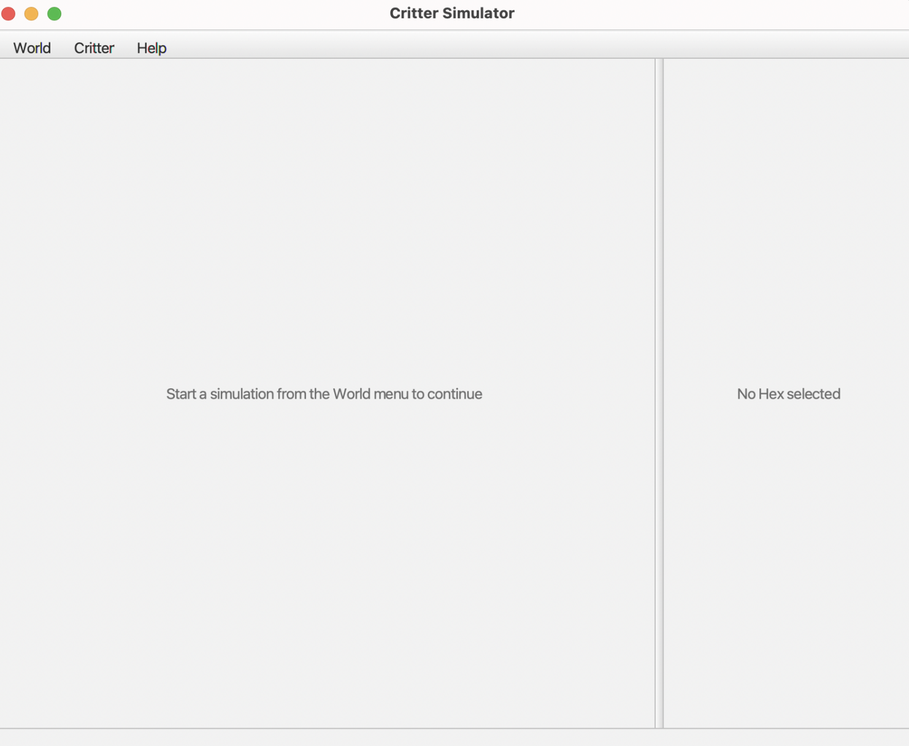  

__Tutorial (Help → Tutorial)__\
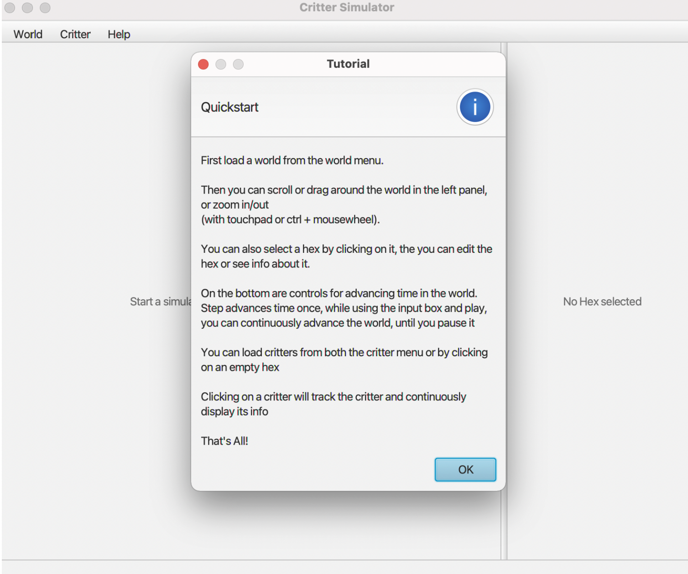  

__Loading a random world (World → Generate Random World)__\
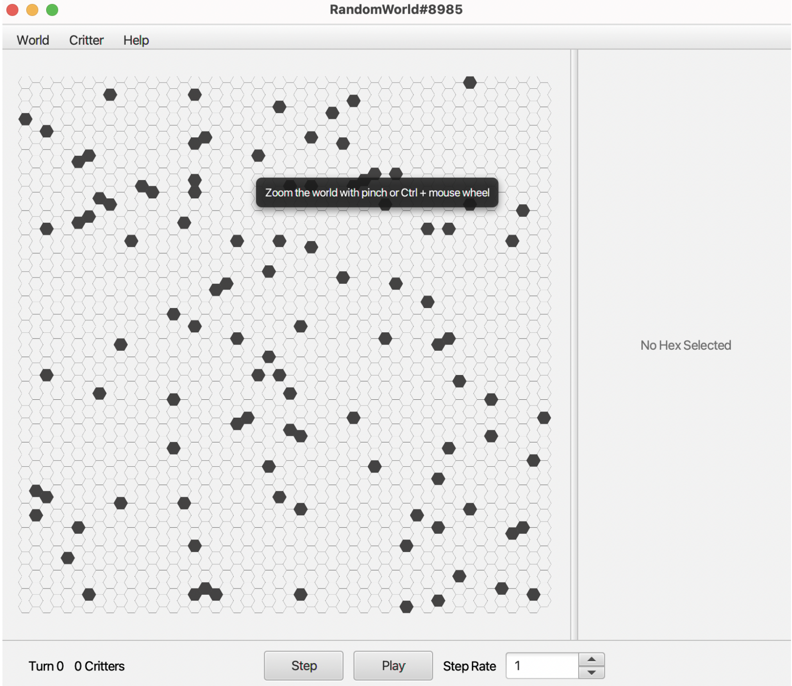  

__Loading a specific world form file (World → Load World From File)__\
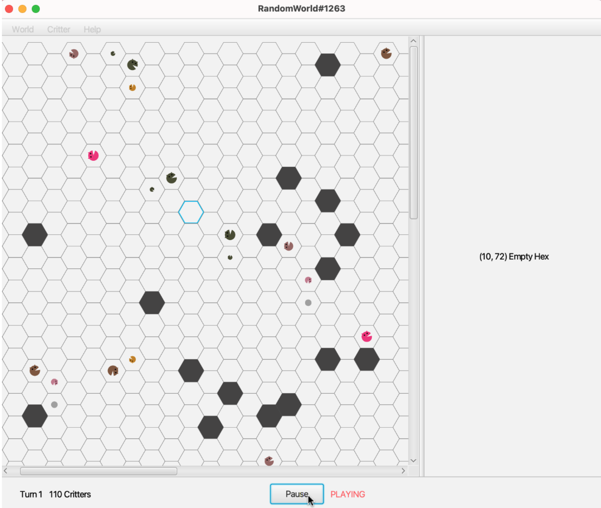  

__Load a critter at a specific index (Critter → Load Critter At Index)__\
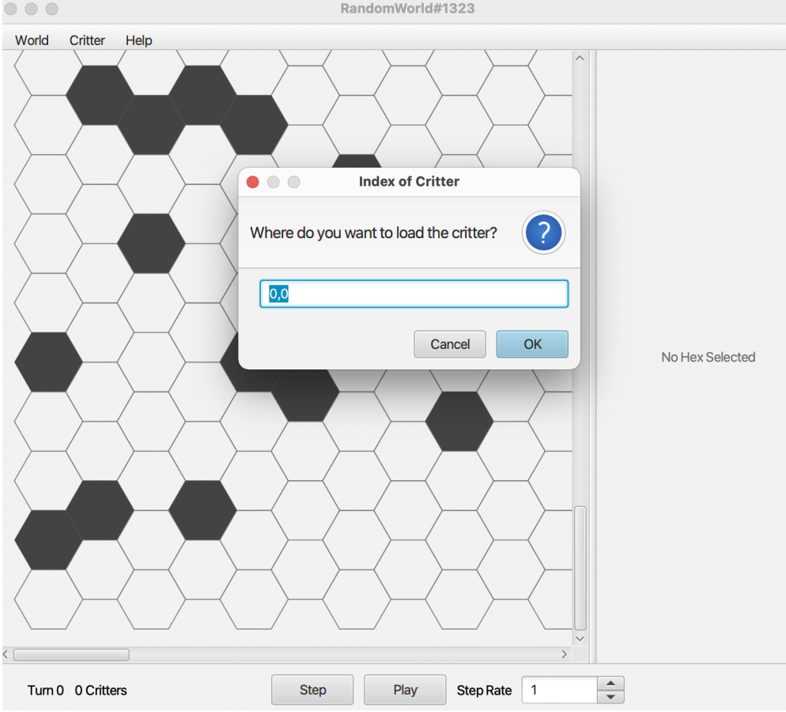  

__Sees info of a critter by clicking on the hex__\
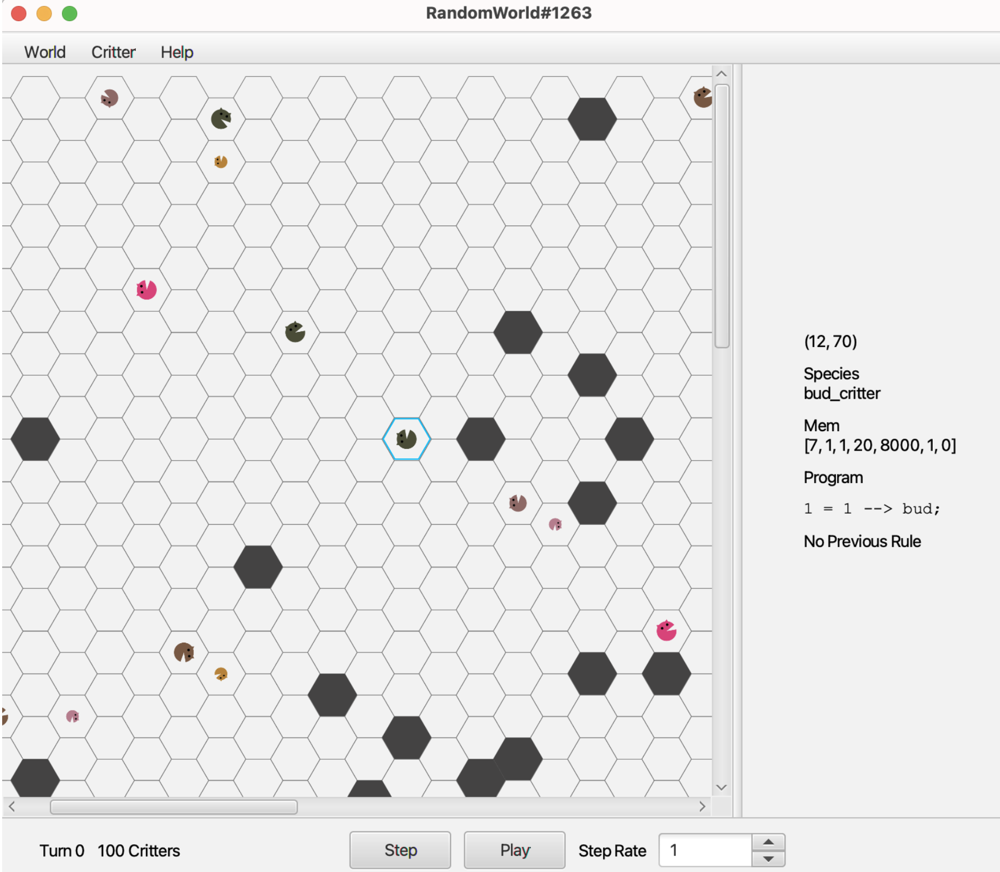  

__The world simulating by clicking the “Play” button__\
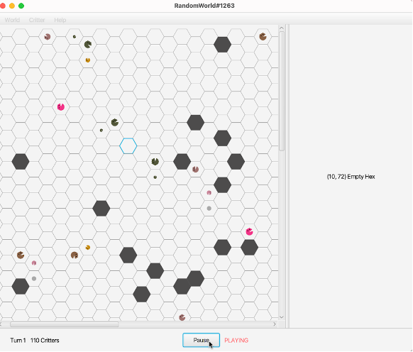  

__Add object at specific hex by clicking on the hex and selecting the buttons on the right__\
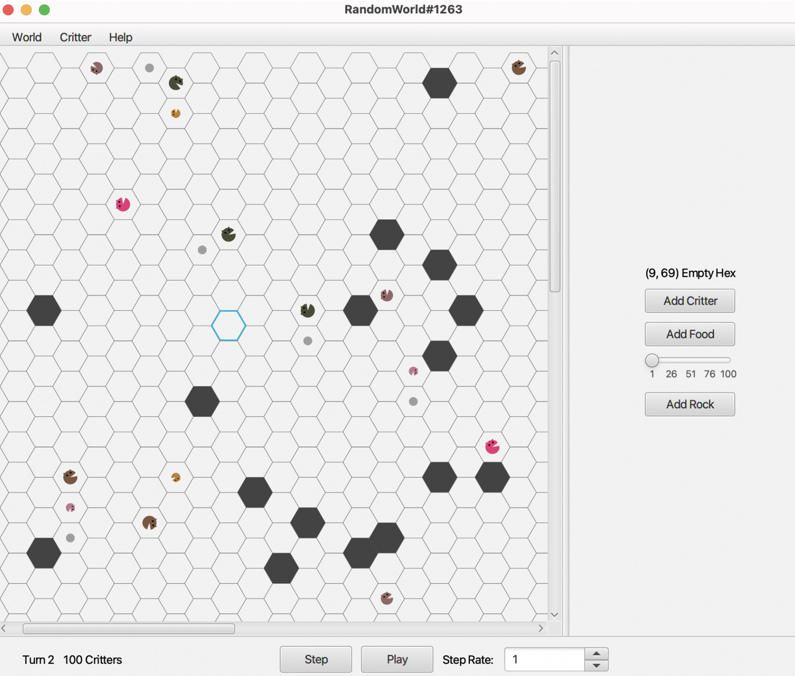  

__Add more food or set empty to a food hex by clicking on hex and selecting button__\
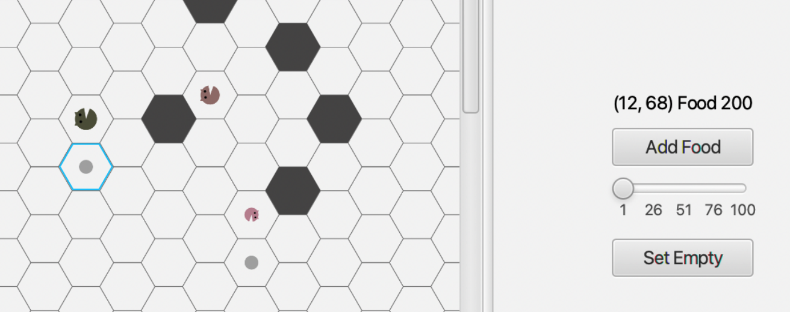  

__Set empty to a rock hex by clicking on hex and button__\
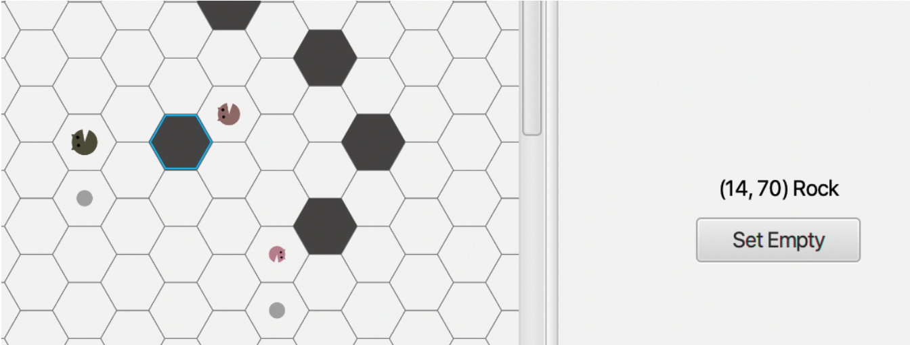  

__Dijkstra's Shortest Path Algorithm__

To enhance critters with intelligence, we implemented an algorithm that enables a critter to find the closest food tile within a predetermined distance in-game, including the number of turns that would be required to eat food directly in front of it. This algorithm is implemented via Dijkstra's Algorithm and a Priority Queue. This enables critters to be more strategic in looking for food.

 

__Spiral Critter__

Here is an example of a spiral critter program that we wrote to control the critter. A critter with such program would runs in the hexagonal world in a spiral.\
Our parser parses the program written in the critter language, converts it into an abstract syntax tree, then interprets the instructions based on conditions occurring in the world, as computed by the simulator. 

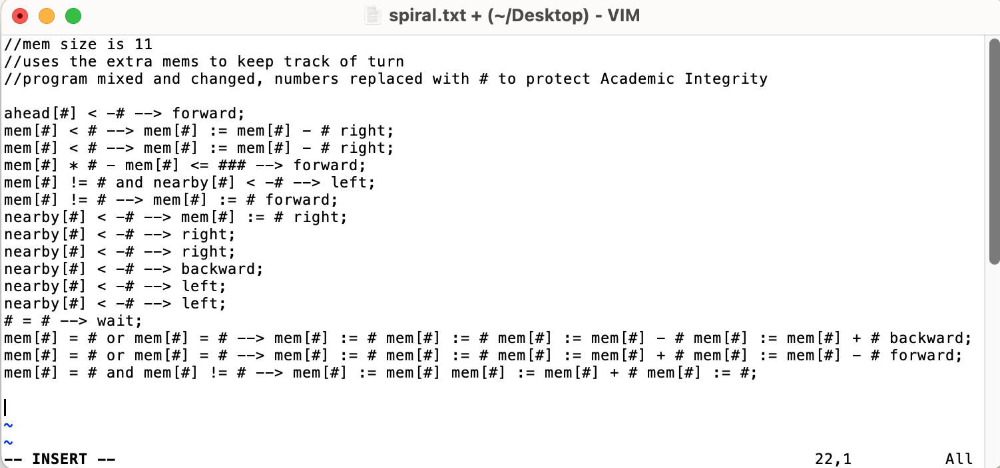  
 

